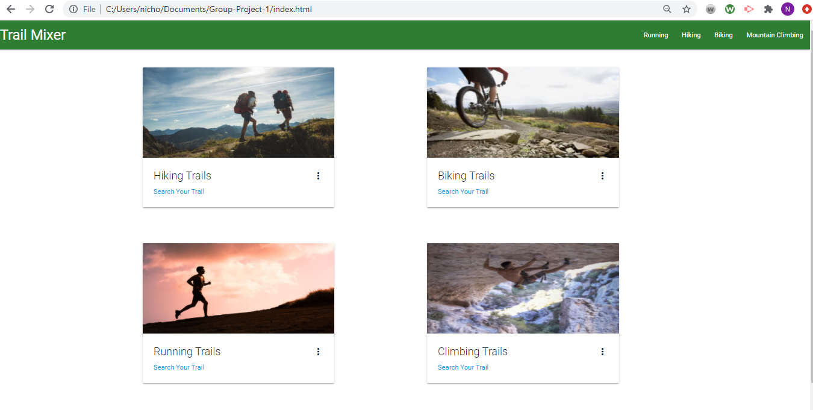
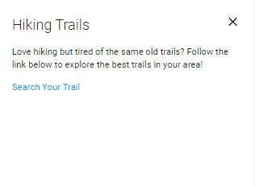
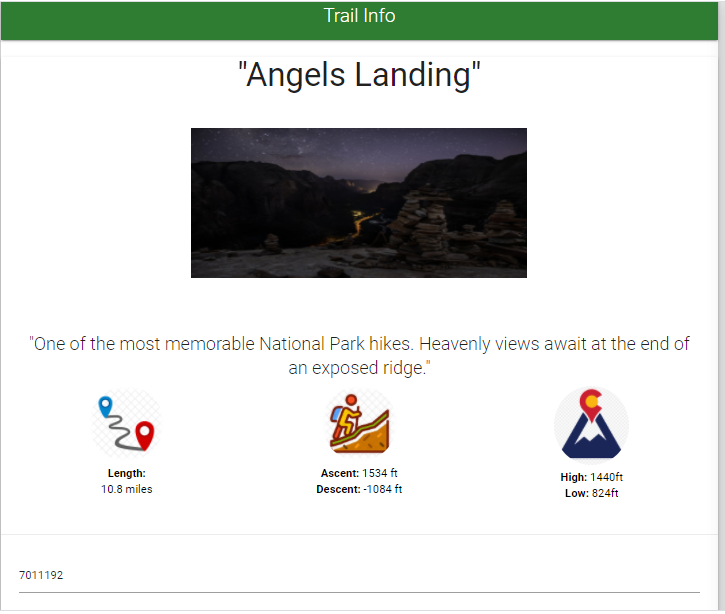
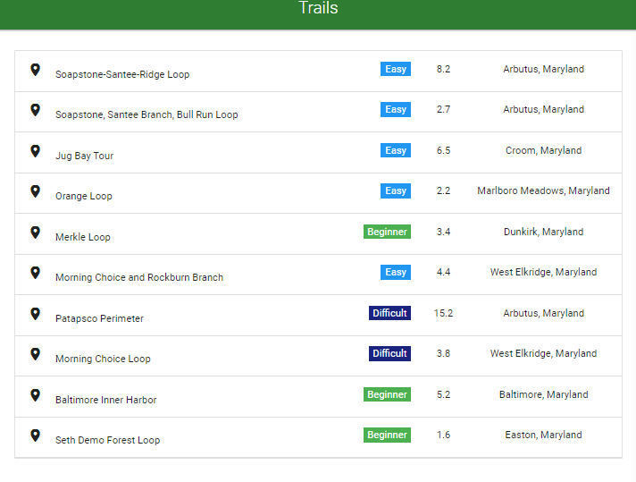

# Group-Project-1
Team: Melvin, Cesar, Lucas, Nick

________________________________________________________________________________________________________________________________________________________________________________
# Hike Planning App

---
### Table of Contents
- [Description](#description)
- [How to Use](#how-to-use)
- [Screenshots](#screenshots)
- [References](#references)

---
## Description
We want to design an application that takes a location from the user, and gives back an optimized hike for their desires.
EXAPMLE:

The user wants a hike with low incline, easy effort

The application provides possible locations, as well as the things they should bring and prepare for to have the best time(food and water to bring, clothing, time of day, weather, animals)

##### Technologies
- Html
- jQuery
- Visual Studio Code
- Materialize
- Open Weather API
- Hiking Project API
##### Code sample - JQuery
#
```js
$("#cityName").keypress(function(event) { 
	
	if (event.keyCode === 13) { 
		event.preventDefault();
		$("#cityName").click(); 
	} 
});
```
##### Code sample - AJAX to get data from the API
#
```js
  $.ajax({
            url: queryUrl,
            method: "GET"
        })
            .then(function (response) {

                console.log(response);
                let tempF = (response.list[0].main.temp - 273.15) * 1.80 + 32;
                console.log(Math.floor(tempF));

                getCurrentForecast(response);

                 localStorage.setItem("lat", JSON.stringify(response.city.coord.lat));
                 localStorage.setItem("long",JSON.stringify(response.city.coord.lon));
                 var maxd = $("#distance").val();
                 localStorage.setItem("distance", JSON.stringify(maxd));
                 
                 

            });
```
---
# Check out the Hiking Trail app!
https://lucasbryg.github.io/Group-Project-1/

## How To Use
When the application is loaded,  The user will have an option to choose from hiking, biking, climbing and running trails.  When the user clicks on a panel, the panal presents a short description about the trail activity as well as a link to take the user to the correct HTML page.  Once the input page loads, the user is able to type in a city and the distance they're willing to travel to get to the trail.  When the user clicks the search button, the table is populated with the names of the trails as well as the difficulty, distance, and location.  The user can then click on a trail in the table to have another panel appear with more information about the trail.  

## Screenshots
- Search Card

- Current Weather Information 

- 5 Days Forecast

- Alert if the city was not found

[Back To The Top](#Weather-Dashboard)
---
## References
- w3school -- [jQuery Tutorial](https://www.w3schools.com/jquery/)
- Materialize -- [Build fast, responsive sites with Materialize](https://getbootstrap.com/)
- W3school -- [The HTML DOM Element Object](https://www.w3schools.com/jsref/dom_obj_all.asp)
- W3school -- [AJAX Introduction](https://www.w3schools.com/js/js_ajax_intro.asp)
- Open Weather API -- [Weather API](https://openweathermap.org/api)
- Hiking Project API -- [HikingAPI](https://www.hikingproject.com/data)
[Back To The Top](#Weather-Dashboard)
